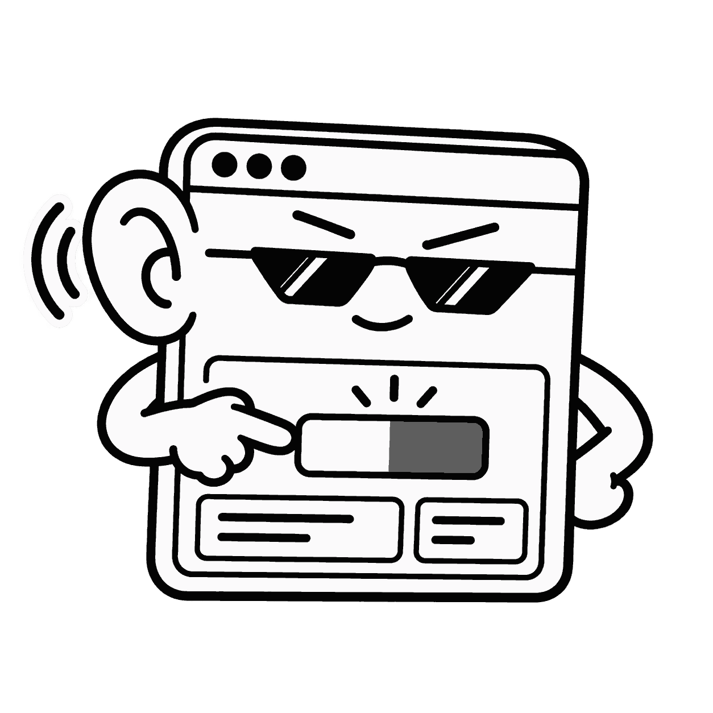
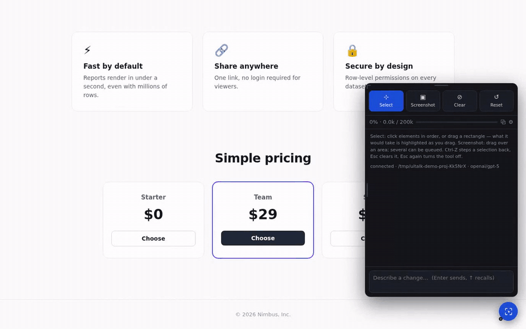
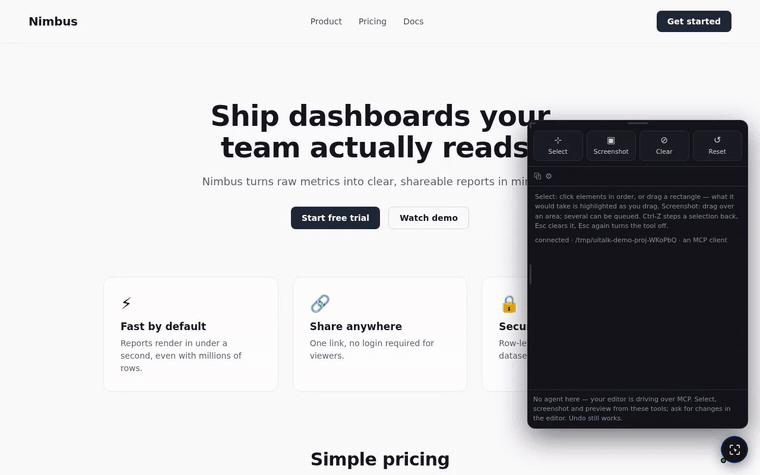
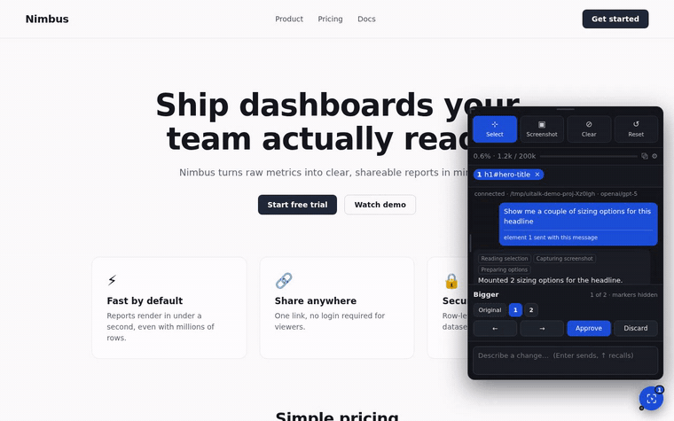
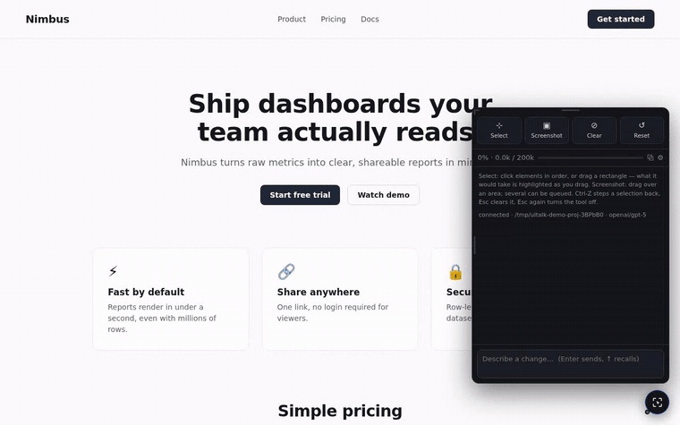
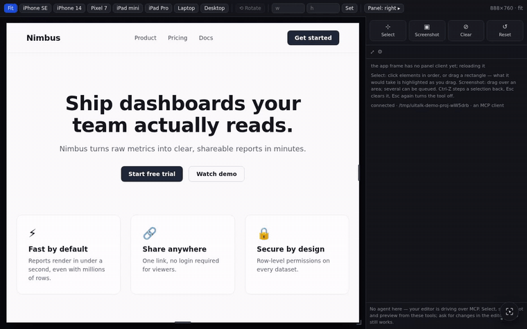

<p align="center">
  
</p>

# uitalk

**Stop describing your UI to an agent that can't see it.** Click the element, say what you want, flip through live alternatives, approve one — and your coding agent commits it to real source. No screenshot pasted into chat, no CSS selector spelled out by hand, no "the second button, no, the *other* second button."

[](https://github.com/haytham-breaka/uitalk/actions/workflows/test.yml)
[](LICENSE)
[](package.json)
[](.claude-plugin/plugin.json)

<p align="center">
  
</p>
<p align="center"><sub>Point at the card, ask, flip through the options live, approve one — it lands in <code>style.css</code>. <a href="docs/media/story.mp4">Watch a full session</a> for the rest: positioning by number, a phone-width fix from inside the device frame, a change scoped to one element, undo.</sub></p>

Nothing is written into your project to install it, and no credentials live in the page.
By default the agent is the Claude Code session you are already logged into — no second
API bill — but any OpenAI-compatible model, a self-hosted one, an OpenCode session, or
any MCP-capable editor can answer instead.

## Contents

- [Why uitalk](#why-uitalk)
- [Install](#install)
- [Usage](#usage)
- [Features](#features)
- [Who answers: agent modes](#who-answers-agent-modes)
- [Other editors (MCP)](#other-editors-mcp)
- [Architecture](#architecture)
- [Configuration](#configuration)
- [Contributing](#contributing)
- [Licence](#licence)

## Why uitalk

- **Works with any stack.** The bridge proxies your dev server and injects the panel on the way through, so Vite, Next, Rails, Django, PHP, Go templates or plain static files all work with zero framework-specific code. It doesn't know or care what's rendering the page.
- **Model-agnostic where it counts.** Selection, screenshots, preview, variants and undo are the browser's and git's work, not a model's. The model only reads your message — and you choose which one, including one running on your own machine with no API key at all.
- **Real pixels, not a DOM guess.** Screenshots come from the Screen Capture API, so canvas, video, cross-origin images and backdrop filters look the way they actually look — not the way a headless renderer thinks they should.
- **Nothing lands until you say so.** Variants are live CSS on the real page, not a diff you have to imagine. Approving commits the one you chose; undo reverts it, because "approved" and "final" are not the same word.
- **An answer with a hole in it says so.** A font that wouldn't embed, a stylesheet that couldn't be read, an edit that didn't take effect: reported, not silently swallowed. The one thing worse than a tool that fails is a tool that fails quietly.

## Install

**Fastest path:** in Claude Code, `/plugin marketplace add haytham-breaka/uitalk` then `/plugin install uitalk@uitalk`; in your app's directory, `claude` then `/uitalk`. That's a panel open on your running app in about a minute. The rest of this section is for when the default install route isn't the one you want; [agent modes](#who-answers-agent-modes) is for when the default agent isn't.

Requires **Node 20.11+** and, for native screen capture, a Chromium browser. The launcher is plain Node, so it runs the same way on Linux, macOS and native Windows (cmd.exe or PowerShell) — no bash, WSL or Git Bash required.

### As a Claude Code plugin (recommended)

The repository is its own marketplace. From inside Claude Code:

```
/plugin marketplace add haytham-breaka/uitalk
/plugin install uitalk@uitalk
```

Or from a terminal, `claude plugin marketplace add haytham-breaka/uitalk` then `claude plugin install uitalk@uitalk`. Claude Code clones the repo into its plugin cache and installs the dependencies itself, so there is nothing else to run; `uitalk` is on the PATH of every session while the plugin is enabled, and `/plugin` updates it.

### From a clone, for hacking on it

```bash
git clone https://github.com/haytham-breaka/uitalk.git ~/src/uitalk
cd ~/src/uitalk && npm install && npm run install-plugin
```

That symlinks the checkout into `~/.claude/skills/`, so an edit to the source shows up in the next session with no reinstall. Don't run both routes at once — each registers `/uitalk`.

### As a standalone command

Not on npm yet, so from the clone:

```bash
cd ~/src/uitalk && npm install && npm link
```

All three routes give you the same `uitalk` binary and the same panel.

## Usage

### From Claude Code

```bash
cd ~/code/my-app
claude
> /uitalk
```

You do not need to start your dev server first — the skill reads `package.json` for a `dev` script, starts it detached along with the bridge, and hands you the URL. If it is already running, the skill just finds it.

### From the command line

```bash
uitalk                        # start detached, print the URL, exit
uitalk --dev "npm run dev"    # run the dev server detached too
uitalk --app-port 3000        # your dev server is not on :5173
uitalk --status               # is one running for this project?
uitalk --stop                 # stop this project's bridge
uitalk --list                 # every bridge running
uitalk --fg                   # foreground instead (Ctrl-C to stop)
```

**It detaches by default, and that matters.** A bridge has to outlive the shell that started it — run as a background job of an agent's shell, it would be reaped along with that shell, mid-edit. `uitalk` puts the server in its own process group (a console-detached process on Windows), waits for it to claim a port, and prints the real URL. Logs go to `~/.uitalk/logs/<project>.log`; running it again while one is already up for the same project just prints that URL, so it is safe to re-run.

### The panel

Open the app at the URL the launcher printed and click the floating **◈** (drag it anywhere; the pip shows how many elements are selected, the dot shows the socket). The panel resizes by dragging its **top edge** for height, its **left edge** for width, or the **top-left corner** for both.

| Tool | Does |
|---|---|
| **Select** | Arms the picker. Click elements in order; each gets a numbered badge. Drag on empty background to select by region. |
| **Screenshot** | Sends a picture of the selection — or a dragged region — with your next message. |
| **Clear** | Drops the selection. |
| **Reset** | Throws away every previewed style and restores replaced markup. |
| **Ctrl/Cmd-Z** | Steps the selection back — a pick, a deselect, an area drag, or a clear. |
| **Esc** | Unwinds one layer: dismiss alternatives, then clear the selection, then turn the tool off. |
| **← →** | Steps through alternatives — including **Original**, so comparing against the unstyled page is part of the same sequence. In the screenshot viewer they step between queued shots. |
| **Variant buttons** | **Original** plus 1…N under the label, for jumping straight to any variant. |
| **Approve** | Sends the chosen alternative to the agent to commit to source. |
| **↑ / ↓** in the composer | Recalls what you have sent, to resend or edit first. Esc cancels the recall. On a multi-line message the arrows move the caret as usual — recall only triggers from the edge line. |

Refer to selections by number: "align element 2 to the top of element 1", "make 1 and 2 the same width", "give me 3 versions of 2". You can also send **just a screenshot** and ask for variations, with nothing selected — the agent scans the region, identifies the element, and targets it by CSS selector.



## Features

### Live variants and approval

Ask for options and the agent mounts them as live CSS on the real page — flip through with the arrows or the numbered buttons, compare against **Original**, then approve one. Only then does the agent touch a file. That loop is the clip at the top of this page. A clear, single-answer request ("make this button a deep purple gradient") skips the preview and edits directly — asking permission to do the obvious thing isn't careful, it's just slow.

### Undo, backed by git

Before the agent writes, the bridge snapshots the working tree with `git stash create`. An **↩ undo** button appears beside the tray; reverting restores the files the agent actually changed — new files it created are removed too, and if you've edited one of those files again yourself since, undo leaves it alone rather than clobbering your work. Projects without git history get no undo button rather than a broken one — better to admit there's nothing to revert to than to pretend there is.



### Verified edits, with before/after

Approving records the computed values the preview was producing, then re-reads them once the agent has finished. If they drifted — the usual cause being a rule written somewhere that loses the cascade — the panel says so and the agent is told which properties missed and pointed at `describe_styles`. Approving also captures the element **before** the edit and again after, and shows them side by side, so "did that work?" is a look rather than a memory.

### Real-pixel screenshots

Via the Screen Capture API: the browser asks once which surface to share (pick this tab), then every capture is a crop of the live compositor output. The panel warns you before that prompt appears, so it is not mistaken for something to dismiss. If you decline, or the browser lacks the API, it falls back to rendering the DOM to an image and labels those shots **rendered**, since that path cannot reproduce canvas, video or cross-origin content. Turn the native path off in ⚙ (`nativeCapture`) if you prefer it.



### Device sizes and split screen

Click **⧉** in the panel's meter row. The shell puts your app in an iframe, which is the only way to test a mobile layout honestly: `@media` rules answer to a real viewport, so resizing a `<div>` would change nothing they can observe. Inside the frame the app genuinely believes it is 390px wide.

Presets for iPhone SE/14, Pixel 7, iPad mini/Pro, laptop and desktop, plus **Rotate**, a custom width×height, and **drag handles** on the frame's edges. **Panel: right ▸** cycles which edge the chat sits on. A device bigger than your screen is scaled down to fit while still reporting its full viewport to the app. The simulated screen travels with every message as `page.screen = { preset, width, height, orientation, zoom }`, so "why does this wrap" is answerable — the agent isn't guessing about your viewport any more than it's guessing about your CSS.



### Apps without live reload

Vite, webpack and Next push changes into the browser themselves. A Flask, Django or FastAPI dev server restarts but leaves the page as it was. The panel detects whether the app hot-reloads and, when it does not, reloads it before judging the result — the frame in split screen, the whole page otherwise, with the pending check handed to the next page load rather than lost. Set `reloadAfterEdit` to `always` or `never` to override the detection.

### Context meter and compaction

The panel shows a context meter (percent, tokens used, window). When usage crosses the threshold, the bridge compacts between turns: the agent writes a handover note to itself, the session is cleared, and the note is pushed back in — so facts survive but the token cost of the transcript does not. Because this summarizes and restarts rather than compacting incrementally, it is lossier than the harness's own; raise `compactAtPercent` if summaries start losing detail you needed.

**Sessions:** one per bridge process. Opening the panel, reloading the page, or navigating does not start a new one — the agent keeps its context and the panel replays the transcript. **New session** (⚙ pane) is the only reset short of restarting the bridge.

### Several projects at once

One bridge serves one app, so run as many as you have projects — each claims its own port and owns its own agent session, project root and page sockets.

```bash
# terminal 1
UITALK_PROJECT=~/code/my-app     UITALK_APP_PORT=5173 npm start   # -> :8400
# terminal 2
UITALK_PROJECT=~/code/storefront UITALK_APP_PORT=3000 npm start   # -> :8401

uitalk --list
#   :8400 -> 127.0.0.1:5173  pid 8117  /home/you/code/my-app
#   :8401 -> 127.0.0.1:3000  pid 8159  /home/you/code/storefront
```

**Several tabs on one bridge** is fine: each announces itself, and page calls follow whichever you last used. A background tab is never asked — its `requestAnimationFrame` is paused, which used to make captures hang. Instances are recorded in `~/.uitalk/instances.json`, removed on exit, and pruned if a process dies, so `--list` never shows a phantom.

## Who answers: agent modes

The page half of uitalk is model-agnostic. What varies is who reads your message. One setting chooses:

| `agent` | Who answers | Costs |
| --- | --- | --- |
| `builtin` *(default)* | the Claude Code session the bridge runs itself | your existing subscription, no API key |
| `adapter` | any model you hold a key for — OpenAI, Anthropic, Gemini, or anything OpenAI-compatible, including a local one | that provider's per-token price, or nothing for a local server |
| `opencode` | an OpenCode session, driven over its own HTTP API | whatever OpenCode is already configured with |
| `off` | nobody here: an MCP client drives the page tools from your editor | whatever your editor already costs |

```bash
uitalk                                     # built-in Claude session
uitalk --no-agent                          # MCP client drives it
uitalk --agent adapter                     # your key, OpenAI by default
uitalk --agent adapter --provider gemini --model gemini-2.5-pro
uitalk --agent adapter --base-url http://127.0.0.1:8080/v1 --model qwen2.5-coder   # local, no key
uitalk --agent opencode                    # an OpenCode session you already have configured
```

Or commit the choice to the project: `{ "agent": "adapter", "agentProvider": "anthropic" }` in `.uitalk.json`.

[docs/agent-modes.md](docs/agent-modes.md) has the rest: what each mode can and cannot do, where a key is read from (never a setting, never an argument) and how a local model needs none, and setting up OpenCode step by step.

## Other editors (MCP)

A standalone MCP server exposes all of the page tools over stdio, so Cursor, Cline, Windsurf, Zed, Continue, OpenCode — any MCP client — can select elements, capture, preview and offer variants. Start the bridge with `--no-agent`, then point your editor at `uitalk-mcp`:

```json
{
  "mcpServers": {
    "uitalk": {
      "command": "uitalk-mcp",
      "env": { "UITALK_PROJECT": "/path/to/your/app" }
    }
  }
}
```

The MCP server finds the running bridge through the registry, or takes `UITALK_PORT` if you would rather be explicit. One thing changes shape: MCP is request/response, so your choice of variant arrives through **`await_choice`** rather than as a pushed message — that, OpenCode's differently-shaped config, and what the panel hides in this mode are in [docs/agent-modes.md](docs/agent-modes.md#off-any-mcp-editor).

## Architecture

<picture>
  <source media="(prefers-color-scheme: dark)" srcset="docs/media/architecture-dark.svg">
  
</picture>

The bridge sits between your browser and your dev server. It proxies every request, injecting the panel client into HTML responses on the way through — so the app itself needs no change. The panel talks to the bridge over a WebSocket; the bridge exposes the page as **12 tools** (`read_selection`, `capture`, `capture_breakpoints`, `scan_region`, `describe_styles`, `locate_source`, `try_style`, `try_markup`, `show_options`, `ask_choice`, `reset_preview`, `wait_for`), defined once in `server/tool-defs.mjs` and shaped for whichever agent is answering.

**Two agents, not one.** The session you type `/uitalk` into and the session behind the panel are **different agents with separate contexts**. The skill only launches the bridge; the bridge runs its own agent against the same project. That keeps your terminal session free, and it means the panel's context meter and compaction settings apply to the panel's agent alone.

**Localhost only, with no flag to widen that.** The bridge binds to `127.0.0.1` — nothing else, no exceptions, and there is no `--host` option or setting that changes it. That's a real invariant to lean on, not just a default: the proxy also strips the app's CSP and CSP-Report-Only headers from every response so the injected script and its socket aren't blocked, which is fine for a tool that only your own machine can reach, and would not be fine on a network anyone else is on. `UITALK_APP_HOST` configures where your *dev server* lives, not where the bridge itself listens.

Prefer your own URL? `curl http://127.0.0.1:8400/__uitalk/bookmarklet` prints a bookmarklet that loads the same client. It needs re-clicking after each reload, and a strict app CSP can block it.

The file-by-file layout is in [CONTRIBUTING.md](CONTRIBUTING.md#development-setup).

## Configuration

Settings live behind the ⚙ in the meter row and persist to `.uitalk.json` in the project — per app, so each can have its own context budget, capture mode and reload behaviour. Environment variables cover what has to be known before the bridge starts: the project root, the dev server's port, a pinned bridge port. Every setting and variable, with its default, is in [docs/configuration.md](docs/configuration.md).

## Contributing

```bash
npm install --include=dev   # .npmrc omits dev deps, which the suites need
npm test                    # every offline suite
npm run coverage            # the same, measured, failing under 85% lines
```

[CONTRIBUTING.md](CONTRIBUTING.md) has the rest: coding conventions, what each suite covers, how coverage is measured and where it is deliberately low, what has been verified and what has not, and what to know about updating a bridge that is already running.

## Licence

MIT — see [LICENSE](LICENSE). No code in this project is derived from any other; see [NOTICE.md](NOTICE.md) for the dependencies it uses.
